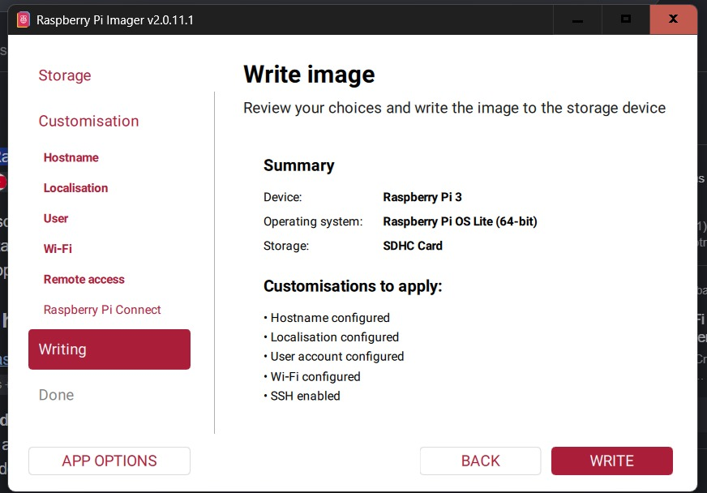
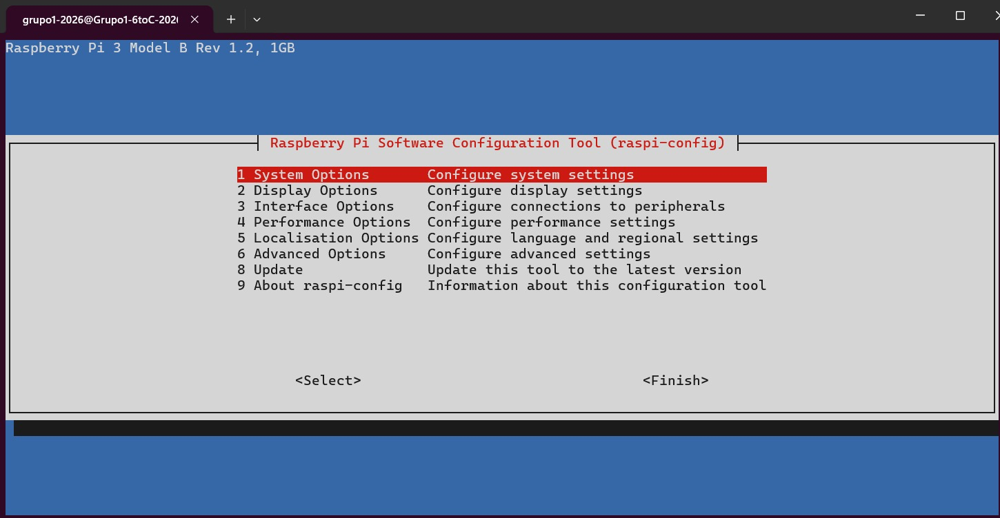
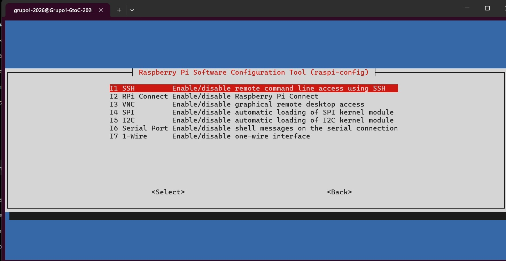

# RASPBERRY - GRUPO 1
#### INTEGRANTES: Vercellone Pedro, Baravalle Bautista, Corallo Maximo, Farah Ignacio, Tisano Fabrizio.
#### Profesores Nicolás Falco y Teo Reyna.  

**______________________________________________________________________________________________________________**

### Indice:

1. [Introducción](#introducción)
2. [Objetivo del Informe](#objetivo-del-informe)
3. [Marco Teórico](#marco-teorico)
   - [Raspberry Pi](#Raspberry-pi)
   - [SSID](#ssid-service-set-identifier)
   - [SSH](#ssh-secure-shell)
4. [Procedimiento](#procedimiento)
   - [Instalación de Raspberry Pi Imager](#instalación-de-raspberry-pi-imager)
   - [Instalación del Sistema Operativo](#instalación-del-sistema-operativo)
   - [Configuración inicial de la Raspberry Pi](#configuración-inicial-de-la-raspberry-pi)
   - [Actualización del sistema](#actualización-del-sistema)
   - [Habilitación de SSH](#habilitación-de-ssh)
   - [Conexión remota mediante SSH](#conexión-remota-mediante-ssh)
   - [Comprobaciones de conexión](#comprobaciones-de-conexión)
5. [Comandos Utilizados](#comandos-utilizados)
   - [hostname -I](#hostname--i)
   - [sudo apt update && sudo apt full-upgrade -y](#sudo-apt-update--sudo-apt-full-upgrade--y)
   - [sudo reboot](#sudo-reboot)
   - [sudo raspi-config](#sudo-raspi-config)
   - [ssh](#ssh-grupo1-202619219260218)
   - [mkdir](#mkdir-carpeta)
   - [ls](#ls)
   - [whoami](#whoami)
   - [wall](#wall-hola-mundo)
6. [Conclusión](#conclusión)

**______________________________________________________________________________________________________________**

## Set-Up de Raspberry e instalacion de SSH
### Fecha: 2 de octubre de 2026 
### Introducción
En este informe explicaremos como hicimos el arranque de nuestra Raspberry Pi con el Raspberry Pi Imager, istalando en ella el OS(sistema operativo) y posteriormente la instalacion de SSH
### Objetivo del Informe
Lograr instalar el OS en la Raspberry y hacer la instalacion de SSH en la misma.

### Marco Teorico
**Raspberry Pi:**
 es una computadora en miniatura, del tamaño de una tarjeta de crédito, diseñada para ser económica y accesible. A pesar de su tamaño, funciona como una PC completa ya que cuenta con procesador, memoria RAM y puertos para conectar periféricos (monitor, teclado, mouse).**En nuestro caso contamos con una Raspberry Pi 3 Modelo B+.**

**SSID (Service Set Identifier):** 
es el nombre público de una red Wi-Fi. Es el identificador que emite el router para que cualquier dispositivo (celular, notebook o una Raspberry Pi) pueda reconocer la red, seleccionarla e ingresar la contraseña correspondiente para conectarse a internet.

**SSH (Secure Shell):** 
es un protocolo de red que permite controlar y administrar un equipo de forma remota a través de una terminal de comandos. Su característica más importante es que crea un canal de comunicación totalmente cifrado, lo que garantiza que las contraseñas y las instrucciones viajen de forma segura entre tu computadora y el servidor (o la Raspberry Pi) sin riesgo de ser interceptadas.

**______________________________________________________________________________________________________________**

### Procedimiento
- Instalacion de RaspBerry Pi imager en  nuestra laptop 
- Colocamos la tarjeta SSD(almacenamiento), en nuestra laptop para con el Raspberry Pi Imager, instalarle en OS a nuestra Raspeberry. **OS utilizado: Raspberry Pi OS Lite (64-bit).**
- Creamos el nombre de usuario y la contraseña principal para iniciar sesión. Despues, elegimos ciudad de servidor(Buenos Aires), layout del teclado(latam), hostname (etiqueta única de identificacion de un dispositivo), contraseña de host, SSID y contraseña de SSID.
- Activamos la opcion para la instalacion automatica de SSH.

**Imagen de la instalacion**

- Una vez finalizada su instalacion, quitamos la tarjeta SSD de nuestra laptop y la insertamos en la Raspberry. Luego, conectamos la misma al teclado y monitor y la enchufamos, para posteriormente prenderla.
- Iniciamos sesion con el username y password que habiamos definido antes, y luego obtenemos la direccion IP de nuestra Raspberry con el siguiente comando:

***hostname -I***

**Nos otorgo la direccion IP 192.168.60.218**

- Luego actualizamos los drivers de la Raspberry con el comando:

***sudo apt update && sudo apt full-upgrade -y***

Posteriormente:

****sudo reboot***

- Luego, al hacer el reboot, tenemos que volver a iniciar sesion en la Raspberry. Luego accedemos a la interfaz de configuracion de la Raspberry con el comando:

***sudo raspi-config***

- Esta interfaz contaba con un menu de 9 opciones, con las flechas del teclado nos desplazamos hasta la opcion 3 (Interface Options), ingresamos con enter y en el primer apartado llamado SSH, damos enter y seleccionamos enable (activar).

- Luego nos desplazamos hasta la opcion "Back" y posteriormente hasta "Finish".
- Desde una de nuestras laptops, dentro de la terminal de WSL o Linux ingresamos el siguiente comando:

***ssh grupo1-2026@192.168.60.218***

- Con este comando accedemos de forma remota a la Raspberry. Se inicia sesion con los mismos datos que desde la Raspberry y hacemos distintas comprobaciones de conexion:
 - Desde una laptop corrimos estos comandos. y 

***mkdir carpeta*** - al hacer ls en la raspberry, se muestra la carpeta creada.

***whoami*** - Devuelve el nombre de la Raspberry. (grupo1-2026)

***wall "hola mundo"*** - Muestra "hola mundo" en la terminal de la Raspberry.

- Asi, finalizando la conexion.

**______________________________________________________________________________________________________________**

    
### Comandos utilizados
- **hostname -I**

hostname: consulta el nombre o información del equipo.
-I: muestra las direcciones IP.
Función: obtener la IP de la Raspberry.

- **sudo apt update && sudo apt full-upgrade -y**

sudo: ejecuta el comando como administrador.
apt: gestor de paquetes de Linux.
update: actualiza la lista de paquetes disponibles.
full-upgrade: actualiza los paquetes instalados.
-y: acepta automáticamente las confirmaciones.
&&: ejecuta el segundo comando si el primero funciona.

- **sudo reboot**

sudo: permisos de administrador.
reboot: reinicia el sistema.
Función: reiniciar la Raspberry después de las actualizaciones.

- **sudo raspi-config**

sudo: permisos de administrador.
raspi-config: herramienta de configuración de Raspberry Pi.
Función: acceder a las opciones del sistema, como habilitar SSH.

- **ssh grupo1-2026@192.168.60.218**

ssh: establece una conexión remota segura.
grupo1-2026: usuario de la Raspberry.
@: separa el usuario de la IP.
192.168.60.218: IP de la Raspberry.
Función: conectarse remotamente a la Raspberry.

- **mkdir carpeta**

mkdir: crea un directorio.
carpeta: nombre del directorio.
Función: crear una carpeta.

- **ls**

ls: muestra archivos y carpetas.
Función: comprobar el contenido del directorio.

- **whoami**

whoami: muestra el usuario actual.
Función: comprobar con qué usuario estamos conectados.

- **wall "hola mundo"**

wall: envía un mensaje a las terminales conectadas.
"hola mundo": mensaje enviado.
Función: comprobar la comunicación entre sesiones.

**______________________________________________________________________________________________________________**

### Conclusión

En conclusión, logramos realizar correctamente la instalación y configuración inicial de nuestra Raspberry Pi 3 B+, instalando el sistema operativo Raspberry Pi OS Lite y habilitando el acceso mediante SSH. Además, comprobamos que la conexión remota funciona correctamente mediante distintos comandos, permitiéndonos administrar la Raspberry desde nuestras laptops sin necesidad de utilizar directamente el monitor y teclado.